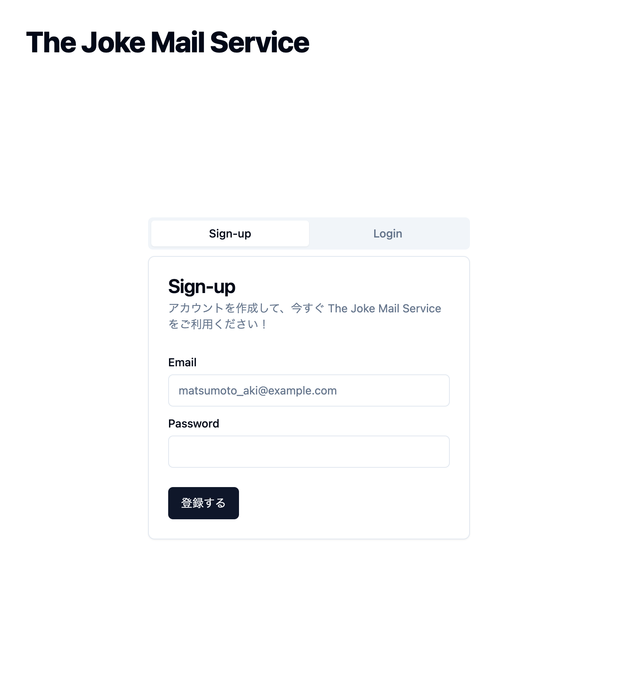

import videoSrc from '../../assets/first-page.mov';

## tabの状態をqueryに持たせる

さぁこれから実際にHands-onを始めて行きましょう。

まずは、`http://localhost:3000/`にアクセスしてみてください。
下記のようなページが表示されるはずです。



このページには、`Sign-up` と `Login` の二つのタブがあります。

それぞれをクリックすると、タブが切り替わります。

このタブの状態をURLに持たせることで、ブラウザのリロードやリンクをクリックした際にもタブの状態を保持することができます。

## 現状の確認

現在は、タブの状態を保持していないため、リロードやリンクをクリックした際にタブの状態がリセットされてしまいます。
試しに、タブを`Login`に切り替えてからリロードしてみてください。
`Sign-up`に戻ってしまいます。

<video src={videoSrc} controls muted/>

## 修正する

まずは、Page の query を取得するために、Props を受け取るように修正します。

```diff lang="tsx"
// apps/workspace/app/page.tsx
import { Input } from "@/components/ui/input";
import { Label } from "@/components/ui/label";
+ import { useFormState } from "react-dom";

- export default function Home() {
+ export default function Home(props: {
+   searchParams: Record<string, string | string[] | undefined>;
+ }) {
```

その次に、`tab`の値を取得します。

```diff lang="tsx"
// apps/workspace/app/page.tsx
  export default function Home(props: {
    searchParams: Record<string, string | string[] | undefined>;
  }) {
+   const tabsValue = props.searchParams.tab === "login" ? "login" : "sign-up";
   return (
```

次に、`Tabs`コンポーネントに`value`を渡します。

```diff lang="tsx"
// apps/workspace/app/page.tsx
- <Tabs defaultValue="sign-up" className="w-[400px]">
+ <Tabs value={tabsValue} className="w-[400px]">
```

そして、`TabsTrigger`コンポーネントに`onClick`を追加して、タブの更新時にqueryを更新するようにします。

```diff lang="tsx"
// apps/workspace/components/ui/tabs.tsx
...

const TabsTrigger = React.forwardRef<
  React.ElementRef<typeof TabsPrimitive.Trigger>,
  React.ComponentPropsWithoutRef<typeof TabsPrimitive.Trigger>
- >(({ className, value, ...props }, ref) => {
+ >(({ className, value, onClick, ...props }, ref) => {
+   const router = useRouter();
+   const pathname = usePathname();
+   const searchParams = useSearchParams();

+   const createQueryString = useCallback(
+     (name: string, value: string) => {
+       const params = new URLSearchParams(searchParams.toString());
+       params.set(name, value);
+ 
+       return params.toString();
+     },
+     [searchParams],
+   );

+   const handleClick = useCallback(
+     (event: React.MouseEvent<HTMLButtonElement>) => {
+       event.preventDefault();
+       const query = createQueryString("tab", value);
+       router.push(`${pathname}?${query}`);
+       onClick?.(event);
+     },
+     [createQueryString, pathname, value, router, onClick],
+   );

  return (
    <TabsPrimitive.Trigger
      ref={ref}
      className={cn(
        "inline-flex items-center justify-center whitespace-nowrap rounded-sm px-3 py-1.5 text-sm font-medium ring-offset-background transition-all focus-visible:outline-none focus-visible:ring-2 focus-visible:ring-ring focus-visible:ring-offset-2 disabled:pointer-events-none disabled:opacity-50 data-[state=active]:bg-background data-[state=active]:text-foreground data-[state=active]:shadow-sm",
        className,
      )}
      value={value}
+       onClick={handleClick}
      {...props}
    />
  );
});

...
```

これで、タブの状態をURLに持たせることができました。
改めて、タブを`Login`に切り替えてからリロードしてみてください。
`Login`のままになっているはずです。

## まとめ

今回は、タブの状態をURLに持たせる方法を学びました。
これで、ブラウザのリロードやリンクをクリックした際にもタブの状態を保持することができるようになりました。
これを応用することで、モーダルを開いた状態のリンクを共有するなど、様々な用途に活用することができます。
