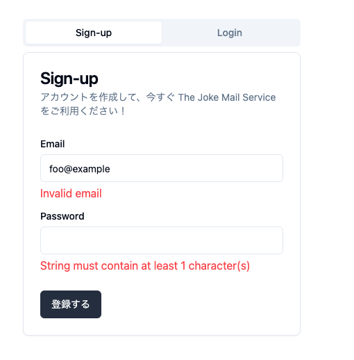

import { Aside } from '@astrojs/starlight/components';

## エラーの情報を表示する
エラーを画面に表示するために、まずは Server Action を変更しましょう。

```diff lang="tsx"
// apps/workspace/app/actions.ts

export async function auth(formData: FormData) {
  const parsedFormData = authSchema.safeParse(
    Object.fromEntries(formData.entries()),
  );
  if (!parsedFormData.success) {
-    throw new Error("Invalid form data", { cause:  parsedFormData.error });
+    return parsedFormData.error.formErrors;
  }

```

このように変更することで、validation に失敗した結果をclient側で取り扱えるようになります。

次に、画面にエラーメッセージを表示するために、`sign-in-form.tsx` を変更して、エラーをStateに保存するようにします。

またエラーを表示するために、クライアントで再レンダリングする必要がある、`use client`をつける必要があります。

```diff lang="tsx"
// apps/workspace/app/components/sign-up-form.tsx
+"use client";
import { auth } from "@/app/actions";
import { Button } from "@/components/ui/button";
+import { useState } from "react";

...

export function SignUpForm() {
+  const [state, setState] = useState<{
+    fieldErrors: { email?: string[]; password?: string[] }
+  }>()
+
+  const formAction = async (formData: FormData) => {
+    const res = await auth(formData)
+    if(res !== null){
+      setState(res)
+    }
+  }

  return (
-    <form action={auth}>
+    <form action={formAction}>

```

あとは、エラーの情報を画面に表示するように変更します。

```diff lang="tsx"
// apps/workspace/app/components/sign-up-form.tsx
...
      <CardContent className="space-y-2">
        <div className="space-y-1">
          <Label htmlFor="email">Email</Label>
          <Input
            id="email"
            name="email"
            type="email"
            placeholder="matsumoto_aki@example.com"
          />
+          {state?.fieldErrors.email && (
+            <p role="alert" className="text-red-500">
+              {state.fieldErrors.email}
+           </p>
+          )}
        </div>
        <div className="space-y-1">
          <Label htmlFor="password">Password</Label>
          <Input id="password" name="password" type="password" />
+          {state?.fieldErrors.password && (
+            <p role="alert" className="text-red-500">
+              {state.fieldErrors.password}
+            </p>
+          )}
        </div>
      </CardContent>
```

ここまで実装できたら、`http://localhost:3000` にアクセスして、再度ログインフォームに下記のような値を入れてみてください。
- email: `foo@example`
- password: "" // 何も入力しない

下記のようにエラーが表示されることを確認してください。


## 組み込みのHooksを利用してより簡潔に書く

`useFormState` を利用することで、簡潔に書くことができます。

`useFormState`を使う前に下記のように action を変更しておきましょう。
理由は後述しますので、まずは変更してみてください。

```diff lang="tsx"
// apps/workspace/app/actions.ts

const authSchema = z.object({
  email: z.string().email(),
  password: z.string().min(1),
});
+ type State = inferFlattenedErrors<typeof authSchema> | null;

- export async function auth(formData: FormData) {
+ export async function auth(state: State, formData: FormData): Promise<State> {
    const parsedFormData = authSchema.safeParse(
    Object.fromEntries(formData.entries()),
  );
  if (!parsedFormData.success) {

```

次に、`useFormState` を利用する形に`sign-up-form.tsx`を変更してみましょう。
```diff lang="tsx"
// apps/workspace/app/components/sign-up-form.tsx

-import { useState } from "react";
+import { useFormState } from "react-dom";

export function SignInForm() {
-  const [state, setState] = useState<{
-    fieldErrors: { email?: string[]; password?: string[] }
-  }>()
-
-  const formAction = async (formData: FormData) => {
-    const res = await auth(formData)
-    if(res !== null){
-      setState(res)
-    }
-  }
+   const [state, formAction] = useFormState(auth, null);
  return (
    <form action={formAction}>
  );
}
```

これで、`useFormState` を利用して、簡潔に書くことができました。

`useFormState` の第一引数には、action を、第二引数にはStateの初期値をとります。
第一引数の action の第一引数には、現在のStateを受け取り、第二引数には、formのデータを受け取ります。

例えば、下記のように書くことができます。

```tsx
const [state, formAction] = useFormState((state, formData) => {
  // 本当はバリデーションしたほうがいいですが、省略
  const count = formData.get('count')
  return count + state
}, 0);
```

このため、action.ts を変更したというわけです。

<Aside type="tip">
  `useFormState` は、`useActionState` に置き換わることになりました。

  この Hands-on 作成時点では、Next.jsでの利用はまだサポートされていないため、`useFormState` を利用しています。
  `useActionState` が利用可能になった際には、そちらを利用することをお勧めします。
  そのまま置き換えられるはずです。

  https://github.com/facebook/react/pull/28491
</Aside>
<Aside type="tip">
  useFormState と似ているものに useFormStatus があります。
  useFormStatus は、action の実行状況を取得することができます。

  詳細はこちらを参照してください。

  https://ja.react.dev/reference/react-dom/hooks/useFormStatus
</Aside>

## チャレンジ💪
sgin-up, login に成功した時にToastを表示してみましょう。

まずは、Layout に `Toaster` を追加します。

```diff lang="tsx"
// apps/workspace/app/layout.tsx
import type { Metadata } from "next";
import "./globals.css";
+import { Toaster } from "react-dom";

...
      <body>
        {children}
+       <Toaster />
      </body>

```

次に、`action.ts`を変更して、sever action が成功したことがわかるようにします。

```diff lang="tsx"
// apps/workspace/app/actions.ts
...

-type State = inferFlattenedErrors<typeof authSchema> | null;
+type State = inferFlattenedErrors<typeof authSchema> | { success: true } | null;
...
  if (response.ok) {
    const result = await response.json();
    cookies().set("___Host-auth", result.message);
-    redirect("/inbox");
+    return { success: true };
  }
```

最後に、`sign-up-form.tsx` に成功した時にToastを表示するように変更します。

```diff lang="tsx"
// apps/workspace/app/components/sign-up-form.tsx
import { Label } from "@/components/ui/label";
+import { toast } from "@/components/ui/use-toast";
+import { useRouter } from "next/navigation";
import { useFormState } from "react-dom";
...
  const [state, formAction] = useFormState(auth, null);

+  const router = useRouter();
+  if (state && "success" in state) {
+    toast({
+      description: "登録が完了しました",
+    });
+    router.push("/inbox");
+    return;
+  }
  
  return (
```

同様の修正を `login-form.tsx` にも行ってみましょう。
ここまでできたら、`http//localhost:3000` にアクセスして、登録、ログインしてみてください。
toast が表示されるはずです。

## まとめ

client component を使って、エラーの情報を画面に表示することができます。
また、useFormState Hook を利用することで、簡潔に書くことができます。
