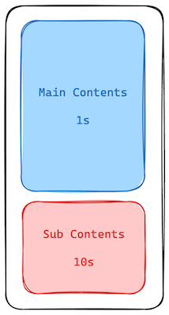

import videoSrc from "../../assets/loading.mp4"

## Inbox の初回表示を高速化する

SSR は、ページのレンダリングが完了するまで、ページのコンテンツをブラウザに送信することができません。

これは、ページのコンテンツが大きい場合には、ページの表示が遅くなる原因となります。

例えば、下記のようなページがあるとします。



この画像は、Main Contents のデータを取得するのに `1s` かかり、Sub Contents のデータを取得するのに `10s` かかることを表しています。

このようなケースでは、Main Contents のデータが取得できた時点で、その部分だけレンダリングを行いレスポンスを返し Sub Contents は後からレスポンスすることでページの表示を高速化することができます。

サーバーからクライアントに HTML を段階的にレンダリングすることを Streaming SSR と呼びます。

今回は、Inbox のメール一覧部分に Streaming SSR を導入してみましょう。

## 実装する

Streaming SSR を導入するためには、`React` の `Suspense` を利用します。
非同期のコンポーネントを`Suspence`でラップすることで、コンポーネントの非同期処理が完了するまで、`fallback` に指定したコンポーネントを表示することができます。

今回のように Page コンポーネント内部でデータ取得している部分を Streaming したい場合には次のようなステップで行うと良いでしょう。

1. Page コンポーネント内部でデータ取得している部分を別のコンポーネントとして切り出す
2. Page コンポーネント内でそのコンポーネントを `Suspense` でラップすることで実現できます。

下記のように実装を書き換えてみましょう
```diff format="tsx"
// apps/workspace/app/(dashboard)/inbox/page.tsx

export default function InboxPage() {
-  const res = (await fetch("http://localhost:8000/inbox", {
-    cache: "no-cache",
-  }).then((res) => res.json())) as MailListData;
-  return <MailList mailList={res} />;
+  return (
+    <Suspense fallback={<div className="text-center">Loading...</div>}>
+      <Mail />
+    </Suspense>
+  );
}

+async function Mail() {
+  const res = (await fetch("http://localhost:8000/inbox", {
+    cache: "no-cache",
+  }).then((res) => res.json())) as MailListData;
+  return <MailList mailList={res} />;
+}

```

ここまで実装が完了したら、`http://localhost:3000/inbox`にアクセスして`Loading...`が表示された後に、メール一覧が表示されることを確認してみましょう。

<video src={videoSrc} controls muted loop autoPlay />

## まとめ

このページでは、Streaming SSR を導入することで、初回表示を高速化する方法を学びました。
TTFBを改善することで、ユーザーのストレスを軽減しUXを向上させることができます。
