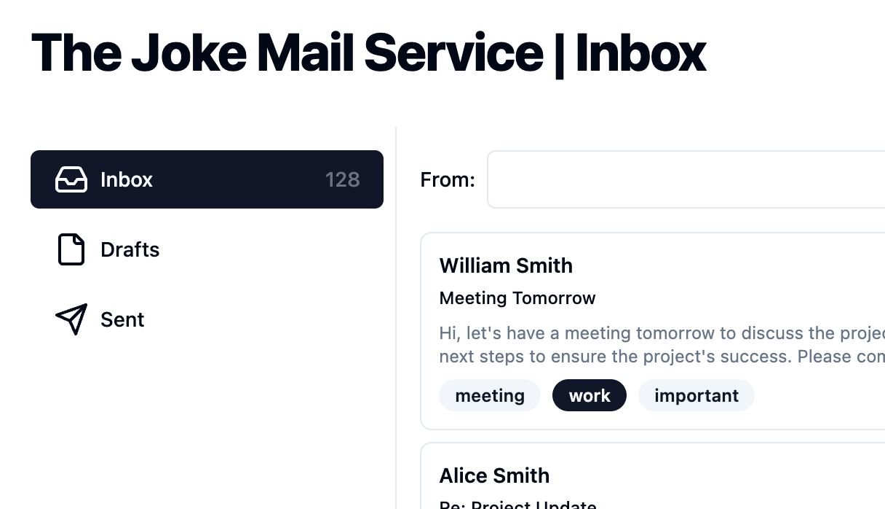
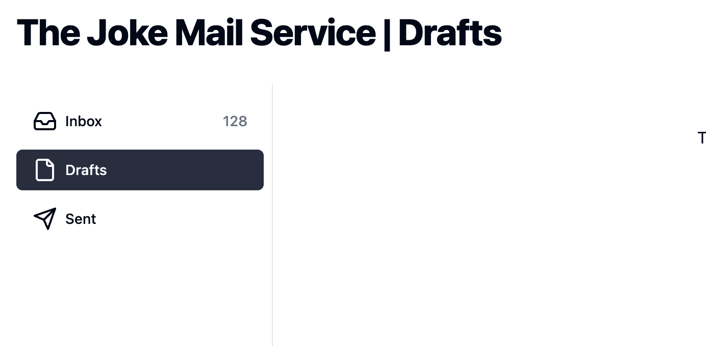

## Page ごとに Headder を変更する

下記のように、Page ごとに Header を変更できるようにしてみましょう。

|inbox|draft|
|---|---|
|

今回は、parallel routes を利用して、Page ごとに Header を変更する方法を紹介します。

## 実装する


`apps/workspace/app/(dashboard)/layout.tsx` を下記のように変更します

```diff format="tsx"
// apps/workspace/app/(dashboard)/layout.tsx
export default function dashboardLayout(props: {
  children: React.ReactNode;
+  header: React.ReactNode;
}) {
   return (
    <main className="relative">
      <div className="p-8 h-dvh">
        <div className="flex items-center justify-between">
          <h1 className="text-4xl font-extrabold tracking-tight">
+            {props.header}
          </h1>
          <form action={logout}>
```

次に、`apps/workspace/app/(dashboard)/@header/inbox/page.tsx`を新規で作成します。
  
```bash
touch apps/workspace/app/(dashboard)/@header/inbox/page.tsx
```

```tsx
export default function Header() {
  return "The Joke Mail Service | Inbox";
}
```

この時点で、`http://localhost:3000/inbox` にアクセスすると、Header が `The Joke Mail Service | Inbox` に変更されます。

つぎに、`http://localhost:3000/drafts` にアクセスしてみてください。404エラーが表示されると思います。

これは、`@headers` という形で分割された先にPageが存在しないためです。

draftも同様に追加してみましょう。

  
```bash
touch apps/workspace/app/(dashboard)/@header/drafts/page.tsx
```

```tsx
export default function Header() {
  return "The Joke Mail Service | Drafts";
}
```

これで、`http://localhost:3000/drafts` にアクセスしても、404が表示されなくなったと思います。

ここで「すべてのページに追加しなければならないのか？」と思うかもしれません。

実は、存在しないPageにアクセスした場合のために、`default.tsx` をつかって、デフォルトのHeaderを表示することができます。

実際に`default.tsx` を作成してみましょう。

```bash
touch apps/workspace/app/(dashboard)/@header/default.tsx
```

```tsx
export default function Header() {
  return "The Joke Mail Service";
}
```

これで、`http://localhost:3000/sent`にアクセスした場合には、`The Joke Mail Service` が表示されるようになっていると思います。
