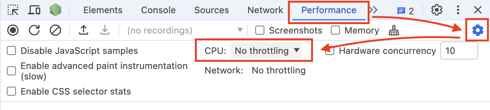

import videoSrc from "../../assets/serach.mp4"
import { Aside } from '@astrojs/starlight/components';

## mail の検索の　UX を向上させる

すでにお気づきの方もいるかもしれませんが、mail の検索の UX があまりよくありません。

<video src={videoSrc} controls muted loop autoPlay />

動画ではわかりにくいですが、入力に遅延がかなりあります。

<Aside type="tip">
体験できませんか？おそらくあなたのPCは高性能で体験できないかもしれません。

devtoolからCPUを制限してみてください。


</Aside>

今回はこの問題を解決するために、`useDeferredValue` を利用して UX を向上させてみましょう。

## 実装する

`apps/workspace/app/(dashboard)/inbox/components/mail-list.tsx`を編集します。

```diff lang="tsx"
// apps/workspace/app/(dashboard)/inbox/components/mail-list.tsx

-import { type ComponentProps, memo, useState } from "react";
+import { type ComponentProps, memo, useDeferredValue, useState } from "react";

export function MailList(props: { mailList: MailListData }) {
  const [searchText, setSearchText] = useState("");
+  const deferredSearchText = useDeferredValue(searchText);


  return (
    <div className="flex flex-col h-full p-4">
      <div className="flex items-center justify-center gap-2">
        <Label htmlFor="search">From:</Label>
        <Input
          id="search"
          className="flex-1"
          value={searchText}
          onChange={(e) => {
            setSearchText(e.currentTarget.value);
          }}
        />
      </div>
      <ScrollArea className="h-full mt-4">
        <div className="space-y-2">
-          <SlowSearchResult searchText={searchText} mailList={props.mailList} />
+          <SlowSearchResult
+            searchText={deferredSearchText}
+            mailList={props.mailList}
+          />
        </div>

```

変更したら、`http://localhost:3000/inbox`にアクセスして、検索をしてみてください。

## まとめ

入力を一文字つつ監視して画面を変更したりする場合には、レンダリングに非常にコストがかかることがあります。

その結果として、入力の体験が悪くなることがあります。

このような場合には、`useDeferredValue` を利用して、UX を向上させることができる場合があります。
