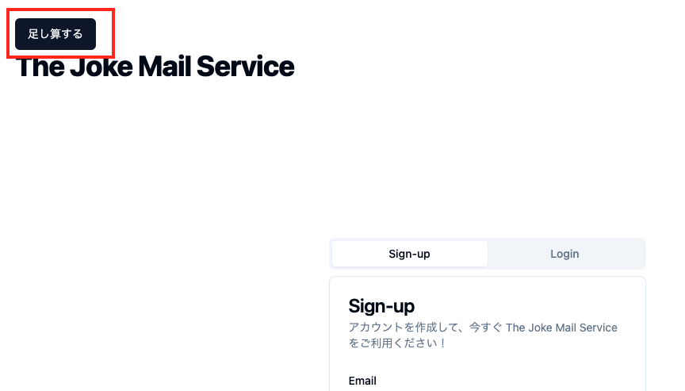
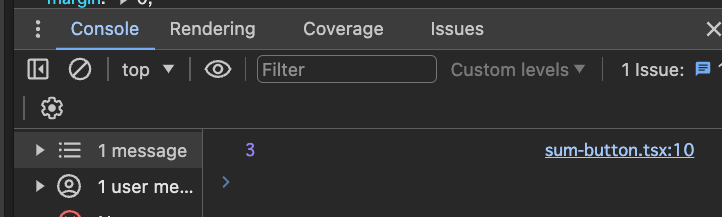
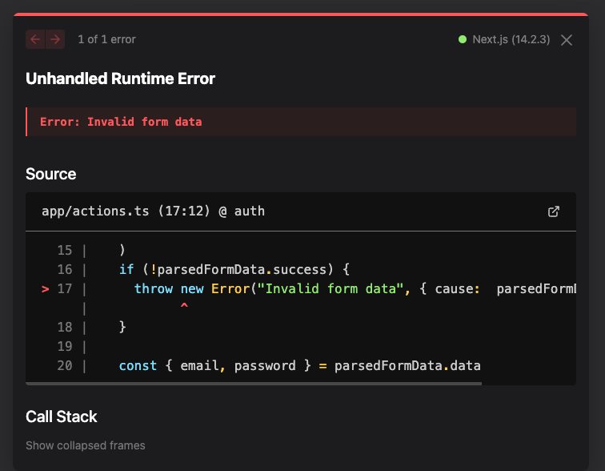

import { Steps } from '@astrojs/starlight/components';
import { Aside } from '@astrojs/starlight/components';
import videoSrc from '../../assets/how-to-server-action-devtool-check.mp4';

## Server Action の引数の validation を行う

Server Action で受け取る引数は、かならずバリデーションを行うようにしましょう。

とくに typescript で実装していると引数に型があるので、引数は安全であると思いがちですが、実際にはそうではありません。


## 引数のバリデーションを行わなかった場合の問題点

実際に、引数のバリデーションを行わなかった場合の問題を体験してみましょう。

`apps/workspace/app/actions.ts` に、簡単な関数を追加してみます。

```tsx
// apps/workspace/app/actions.ts
...

export async function sum(a: number, b: number) {
  return a + b;
}
```

`apps/workspace/app/sum-button.tsx` を追加します。

```tsx
// apps/workspace/app/sum-button.tsx
"use client";
import { sum } from "@/app/actions";
import { Button } from "@/components/ui/button";

export function SumButton() {
  return (
    <Button
      onClick={async () => {
        const res = await sum(1, 2);
        console.log(res);
      }}
    >
      足し算する
    </Button>
  );
}
```

最後に、`apps/workspace/app/page.tsx` に `<SumButton />` を追加します。

```diff lang="tsx"
// apps/workspace/app/page.tsx
import { LoginForm } from "@/app/components/login-form";
import { SignInForm } from "@/app/components/sign-in-form";
+ import { SumButton } from '@/app/sum-button';

...

  return (
    <main className="h-dvh p-8">
+       <SumButton />
```

これで、画面に「足し算する」というボタンが表示されます。




このボタンをクリックすると、コンソールに `3` と表示されるはずです。





では、terminal からこの Server Action を呼び出したらどうなるでしょうか？

これを確かめるために、devtool の network タブから、server action のリクエストを curl としてコピーして実行してみましょう。

確認の仕方は少し複雑なので動画を見ながら確認してみてください。
<video src={videoSrc} controls muted />

<Steps>

1. devtool を開きます

2. network タブを開きます

3. filter アイコンをクリックします

4. Fetch/XHR を選択します

5. 画面の`足し算する`ボタンをクリックします

6. reqeust を確認します

7. curl としてコピーします

</Steps>

ここまでで、clipboard に curl がコピーされました。

terminal に貼り付けて実行してみましょう。

下記のような結果が得られるはずです。
```bash
0:["$@1",["development",null]]
1:3
```
これのうち、`1:3` の `3` が、`sum` 関数の結果です。

そこで、先ほどのcurlを少し変更してみましょう。

`--data-raw` の部分を `["1","2"]` に変更してください。

```diff lang="bash"
curl 'http://localhost:3000/' \

...

-  --data-raw '[1,2]'
+  --data-raw '["1","2"]'
```

結果はどうなるでしょうか？

```bash
0:["$@1",["development",null]]
1:"12"
```

`1:"12"` となりました。文字列としての `1` と `2` が連結されてしまっています。

あらためて、sum の 引数を確認してみましょう。
```tsx
// apps/workspace/app/actions.ts
export async function sum(a: number, b: number) {
  return a + b;
}
```

実装上はnumber型ですが、今回のように何らかの方法で直接リクエストを送信する場合、実行時には型情報が失われてしまいますのでクライアントが好きな値を送信することができます。

今回は文字列が連結されてしまうだけでしたが、ここで DB にアクセスするなどの処理を行っていた場合、セキュリティリスクが発生する可能性があります。

このことから、引数のバリデーションが重要であることがわかります。
<Aside type="tip">
Server Action のリクエストは全て、`POST` メソッドで行われます。
リクエスト先は全て現在のページの URL になります。
複数あった場合には、どのように振り分けているのでしょうか？

その答えは、リクエストヘッダーの`Next-Action`にあります。

Build時に、それぞれの Server Action に対応する ID が割り振られ、
リクエストヘッダーに`Next-Action`の値として、その ID が付与されます。
その ID をもとに、どの Server Action を実行するかが決まっています。

通常の開発ではこの値を気にする必要は全くありませんが気になる方は、
上記の動画でリクエストヘッダーの確認も行っているので、参考にしてください。
</Aside >

## 今回追加した変更を削除する🧹
ここまで確認ができたら、今回追加した変更は不要なので削除しておきましょう。

<Steps>
<ol>
  <li>
    action.ts から sum 関数を削除します

    ```diff lang="tsx"
    // apps/workspace/app/actions.ts
    ...

    - export async function sum(a: number, b: number) {
    -   return a + b;
    - }
    ```
  </li>
  <li>
    sum-button.tsx を削除します

    ```bash
    rm apps/workspace/app/sum-button.tsx
    ```
  </li>
  <li>
    page.tsx から SumButton を削除します

    ```diff lang="tsx"
    // apps/workspace/app/page.tsx
    import { LoginForm } from "@/app/components/login-form";
    import { SignInForm } from "@/app/components/sign-in-form";
    - import { SumButton } from '@/app/sum-button';

    ...

      return (
        <main className="h-dvh p-8">
    -       <SumButton />
    ```
  </li>
</ol>
</Steps>

## 引数のバリデーションを行う

引数のバリデージョンは、お好きなライブラリで行うことができますが、ここでは `zod` を使用します。
まずは、actions.ts にバリデーションを追加しましょう

```diff lang="tsx"
// apps/workspace/app/actions.ts
"use server";
import { cookies } from "next/headers";
import { redirect } from "next/navigation";
+ import { type inferFlattenedErrors, z } from "zod";

+ const authSchema = z.object({
+   email: z.string().email(),
+   password: z.string().min(1),
+ });

- export async function auth(formData: FormData) {
-   const email = formData.get("email") as string;
-   const password = formData.get("password") as string;
+ export async function auth(formData: FormData) {
+   const parsedFormData = authSchema.safeParse(
+     Object.fromEntries(formData.entries()),
+   );
+   if (!parsedFormData.success) {
+     throw new Error("Invalid form data", { cause:  parsedFormData.error });
+   }
+ 
+   const { email, password } = parsedFormData.data;
  const response = await fetch("http://localhost:8000/auth", {
    method: "POST",
    mode: "cors",
    headers: {
      "Content-Type": "application/json",
```

`authSchema.safeParse` でバリデーションを行い、成功した場合は `parsedFormData.data` に、失敗した場合は `parsedFormData.error` にエラー情報が格納されます。
`parsedFormData.success` で成功か失敗かを判定できます。

この状態で、`http://localhost:3000` にアクセスして、ログインフォームに下記のような値を入れてみてください。
- email: `foo@example`
- password: "" // 何も入力しない

すると、画面にエラーメッセージが表示されるはずです。



これで、バリデーションが正常に動作していることが確認できました。

次は、画面にエラーメッセージを表示するように変更していきましょう。


## まとめ

今回は、Server Action で引数のバリデーションを行う方法を学びました。
Server Action で受け取る引数は、かならずバリデーションを行うようにしましょう。

## 参考リンク

- Next.js v14 で Form validation を server 側で行う https://cam-inc.co.jp/p/techblog/859745503506595841
